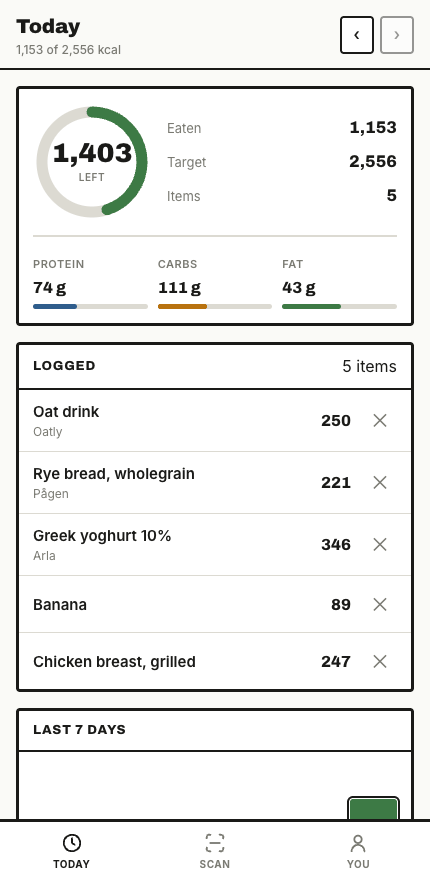
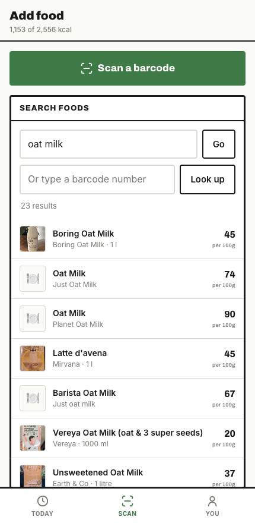
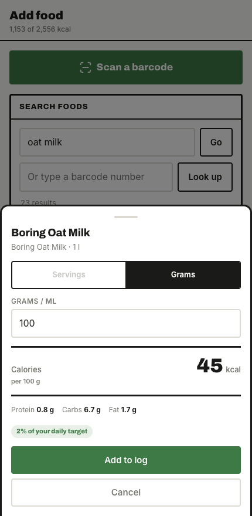
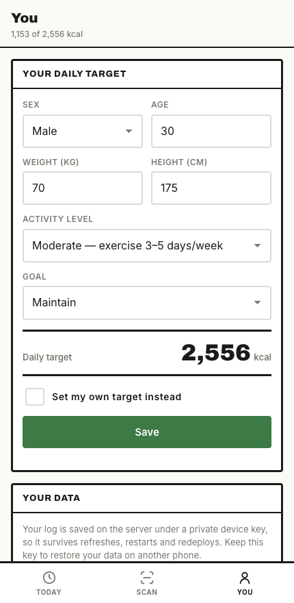

<div align="center">

# Scan & Track

**A free barcode calorie tracker that runs in the browser.**

Point the camera at a barcode, pick a portion, and it's logged against your
daily target. No account, no app store, no subscription — the whole thing is
one Node server and one HTML page.

### [→ Try it](https://web-production-94c1d.up.railway.app)

[](https://web-production-94c1d.up.railway.app)
[](https://world.openfoodfacts.org)
[](public/manifest.webmanifest)
[](package.json)

</div>

|  |  |  |  |
| :--: | :--: | :--: | :--: |
|  |  |  |  |
| **Today** — what's left, and the macros behind it | **Search** — straight out of Open Food Facts | **Portion** — servings or grams, either way | **You** — Mifflin-St Jeor, or your own number |

## Why it exists

Every calorie tracker worth using wants an account, a subscription, or both,
and most of them are a wrapper around the same free food database this one
reads. So: no sign-up, no email, no paywall. Your log is keyed by a random
device key generated in your browser — copy it into another phone and your
data follows. Nothing else identifies you, because nothing else is collected.

## What it does

- **Barcode scanning** — uses the native `BarcodeDetector` where it exists
  (Android Chrome) and falls back to a locally bundled ZXing build everywhere
  else (iOS Safari). Rear camera, torch toggle, and a cropped decode region.
- **Food search** — server-side proxy to Open Food Facts, merging the fast
  search cluster with the older, broader index so plain words return results.
- **Persistent log** — entries, profile and history in SQLite on a mounted
  volume, keyed by a per-device id. Works offline and syncs when back online.
- **Installable** — PWA manifest plus a service worker for the app shell.

## Running locally

```bash
npm install
npm start          # http://localhost:3000
```

The camera needs a secure context. `localhost` counts, but opening the HTML
from a `file://` path does not — that is the usual reason a scanner silently
does nothing.

Data goes to `./data/calories.db` locally, and to `/data` when the Railway
volume is mounted (override with `DATA_DIR`).

## Layout

```
server.js                 Express app: API routes + static hosting
lib/db.js                 SQLite schema and queries (node:sqlite, no native deps)
lib/off.js                Open Food Facts client: lookup, search, normalisation, cache
public/index.html         App shell and styles
public/app.js             UI, scanner, offline queue
public/vendor/zxing.min.js Bundled barcode decoder (no CDN dependency)
scripts/                  Icon and test-barcode generators
```

## API

All endpoints take an `X-Device-Id` header identifying the owner of the data.

| Method | Path | Purpose |
| --- | --- | --- |
| `GET` | `/api/state?date=` | Boot payload: profile, entries, recents, history |
| `GET` | `/api/lookup/:barcode` | Product by barcode |
| `GET` | `/api/search?q=` | Food search |
| `GET`/`PUT` | `/api/profile` | Read / save profile and target |
| `GET`/`POST` | `/api/entries` | List / add log entries |
| `DELETE` | `/api/entries/:id` | Remove an entry |
| `GET` | `/api/history?days=` | Daily totals |
| `GET` | `/api/recents` | Most-logged foods |
| `GET` | `/healthz` | Healthcheck |

Rate limited per IP, in memory: **120 writes an hour** (profile, add entry,
delete entry) and **300 upstream lookups an hour** (barcode lookup, search).
The second budget is separate because those requests cost Open Food Facts
bandwidth rather than disk here. Limited responses carry `Retry-After` and the
`X-RateLimit-*` headers. Both reset on deploy and are per-instance, which is
right for one small box and would not be for a fleet.

## Environment

| Variable | Purpose |
| --- | --- |
| `PORT` | Listen port. Must match the Railway domain's target port (2020). |
| `DATA_DIR` | Where the SQLite file lives. `/data` in production. |
| `OFF_USER_AGENT` | Identifies this app to Open Food Facts. |

## Deploying

```bash
railway up --service web
```

The service needs a volume mounted at `/data`; without it the log resets on
every deploy.

## Testing the scanner without a product

```bash
python3 scripts/make-test-barcode.py   # writes test-barcode.png
```

Point the camera at that image on another screen, or type `737628064502` into
the barcode box.
